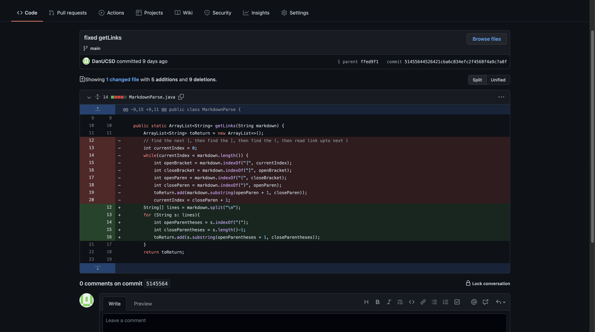
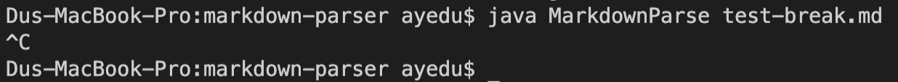
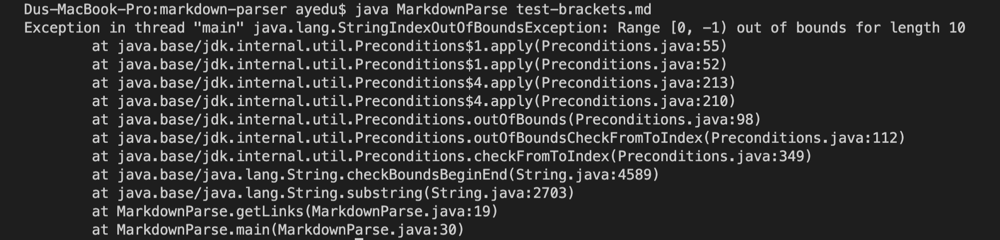
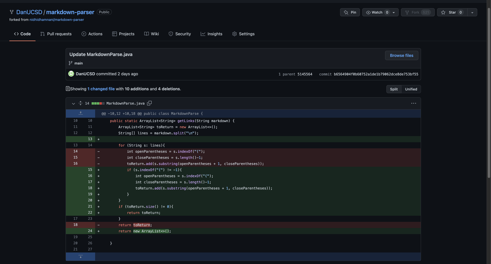

# Lab Report 2

## Code Change 1

[Failure-Inducing-Input](https://github.com/DanUCSD/markdown-parser/blob/main/test-break.md)

While we were trying to break the markdown parser, we didn't expect an infinite loop. This bug is caused by having some parentheses in the link. The symptom shows up as an infinite loop that I had to force stop.

## Code Change 2

[Failure-Inducing-Input](https://github.com/DanUCSD/markdown-parser/blob/main/test-brackets.md)

Since there is no set of parenthesis, the bug caused a symptom as seen by the exception. test-brackets does not contain any link so the input induced failure.

## Code Change 3

[Failure-Inducing-Input](https://github.com/DanUCSD/markdown-parser/blob/main/test-empty.md)

It breaks because there is no check for whether or not there is a set of parentheses present in the code or not. This bug caused the symptom of out of range.