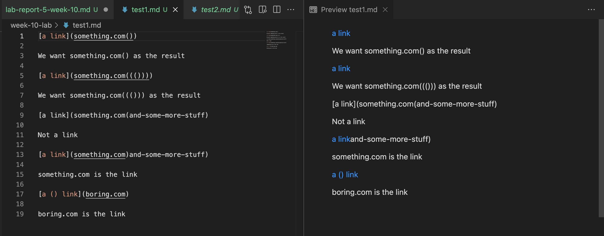
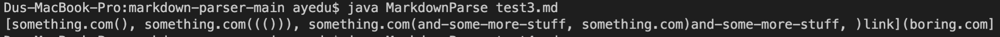
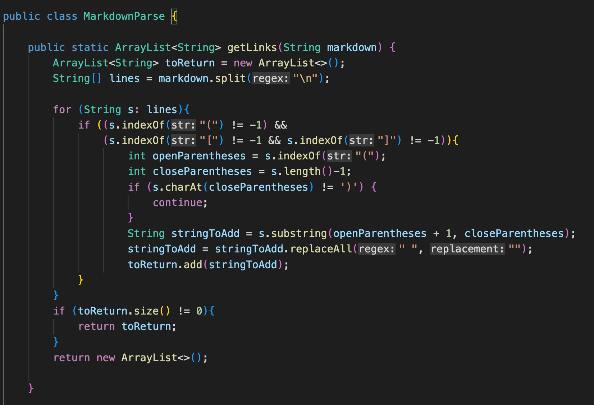
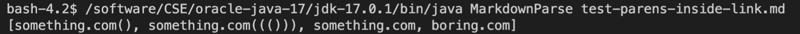
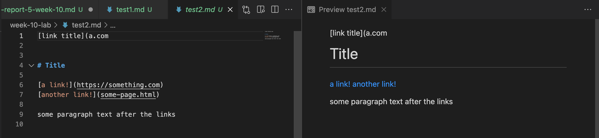
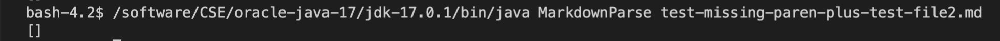
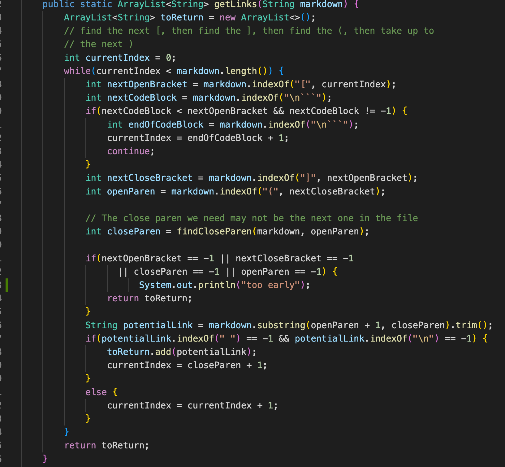

# Lab Report 5

I search through the tests manually since I figured that if I went the vimdiff way, I'd end up with more work trying to find out how to do a for loop in bash and dealing with wrong java versions so I just went with the longer way.

The test file will be in this repository 

## Test 1

[Test 1](https://DanUCSD.github.io/cse15l-lab-reports/week-10-lab/test1.md)

That is the expected output for test1. My group's implementation was incorrect, and the provided implementation was correct.

This is what my implementation gives. The reason why it failed is because it relied on the fact that everything that looks like a link should have the formula of "[link name]"(link.com) (but without the "). The reason why this fails is because it takes the last character of the line has to be ")", not the first occurence of this character.

Since this is a fairly simply idea to implement, to fix this code to work with this file, the line that has int closeParentheses must be reworked.

This is the correct implementation.

## Test 2

[Test 2](test2.md)

That is the expected output for test1. My group's implementation was correct, and the provided implementation was incorrect.

This is what the provided implementation gives. The reason why it failed is because it couldn't find a closing parentheses using the findCloseParen() function. It then closes out too early before going on to find more links.

This is way more complex but from what I was able to debug, where I marked "too early" is where I think a fix can be made. Maybe move on and try to find more links rather than immediately return it, but it could lead to issues further down the line.

This is the correct implementation.