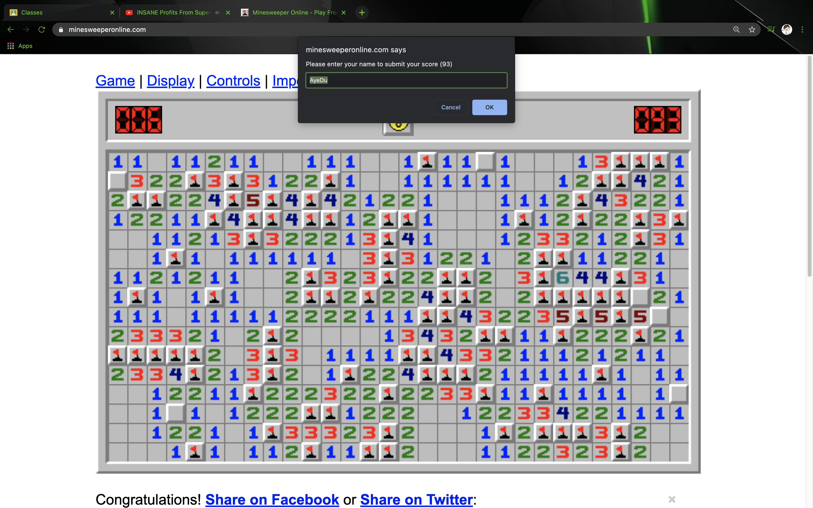
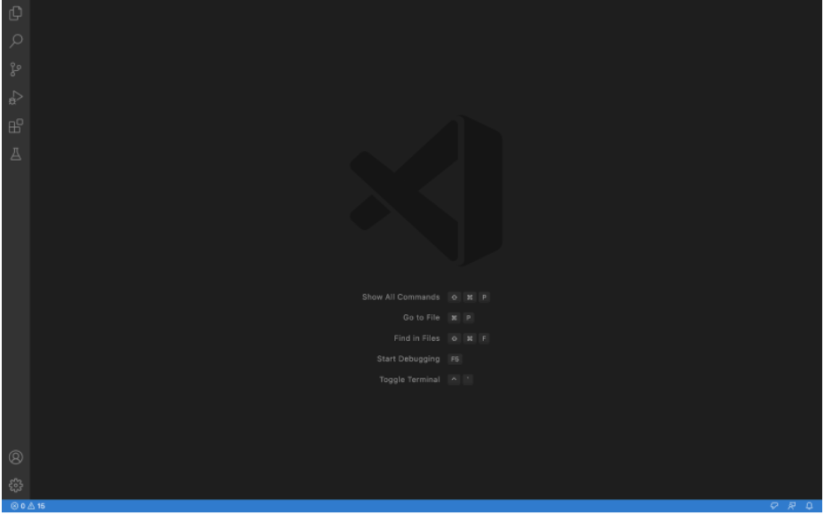
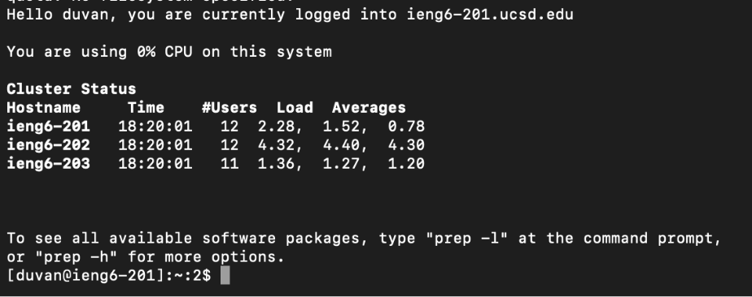
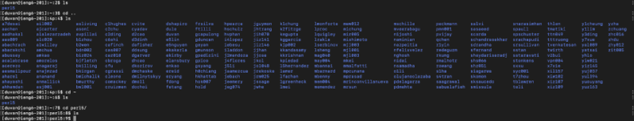
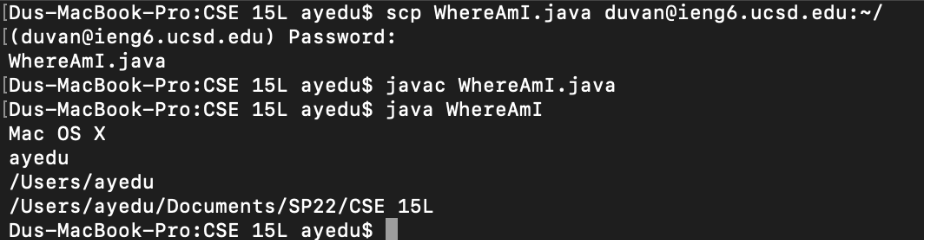
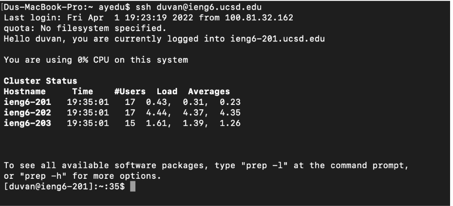
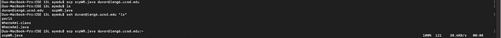
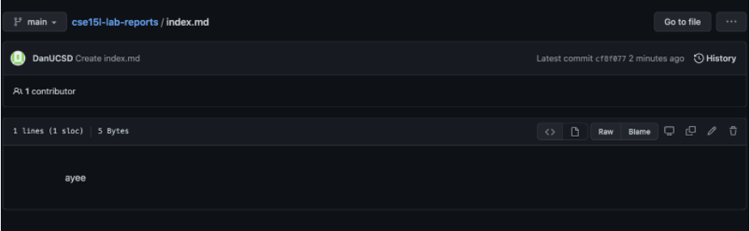
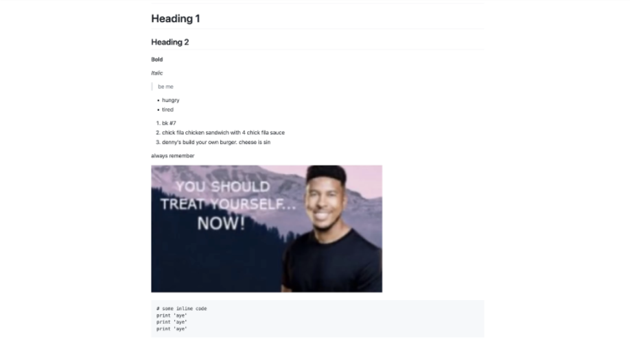
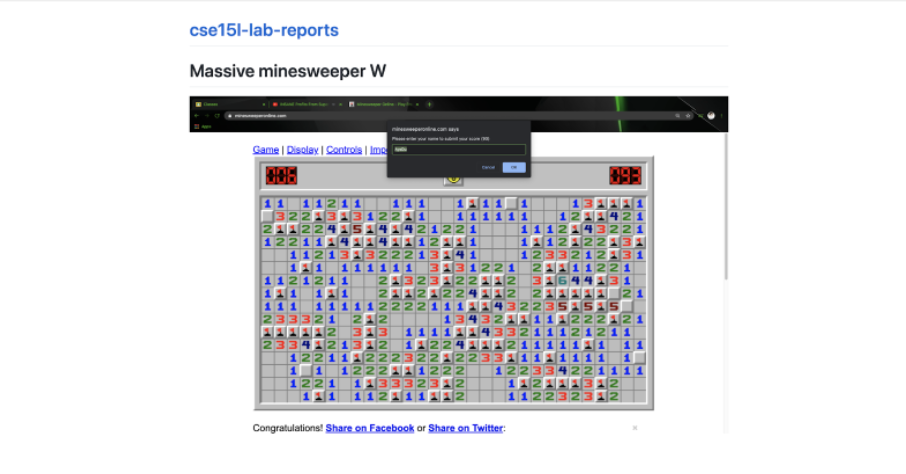

# Massive minesweeper W


# The Lab Report 1 Experience

*Spends the majority of the lab trying to be witty and creative*

**GITHUB UPDATES SO SLOWLY REEEEEEE**

> what should i use for my screenshot h m m mmm

``` 
# some inline code
print 'aye'
print 'aye'
print 'aye'
```

[VSCode](https://code.visualstudio.com/)

# Lab 1

## Part 2


## Part 3


## Part 4

I used cd .. and ls to see what files are on the server



## Part 5

Running on the server would give the properties of the server, doing so on the client would give it the client’s properties. 



## Part 6

It saves quite a bit of time since I don't have to input the password in and deal with typos.



## Part 7 

I transferred without having to log in, saving at least 20 keystrokes. In addition to that, I could've used ; to do multiple commands on one line to save even more time




# Lab 2

## Part 1

The server is creating a folder named after the repository and inside it is a file called with my text in it.




## Part 2

Sometimes, committing changes could help save a devastating bug. Multiple people could be working on a project and when someone commits, it might be useful for the rest of the team to check it over before pushing it.

## Part 3



The second one is just a link to the page. The first one is opening a file. Both should be the same on the internet, but on my device, since I don’t have the html file, it shows that I don’t have the html file for lab report 1 week 2.