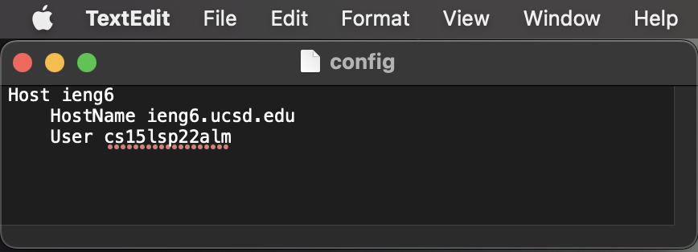
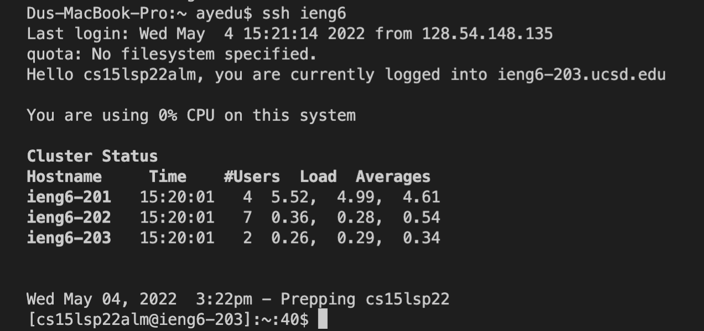

# Lab Report 3

## Streamlining ssh Configuration

Here, I used TextEdit to edit ~/.ssh/config. 

I logged in using ssh ieng6, which is the alias I chose to log in here.

Here, I used ieng6 to quickly transfer my schedule from my desktop to the remote server.

## Setup Github Access from ieng6
