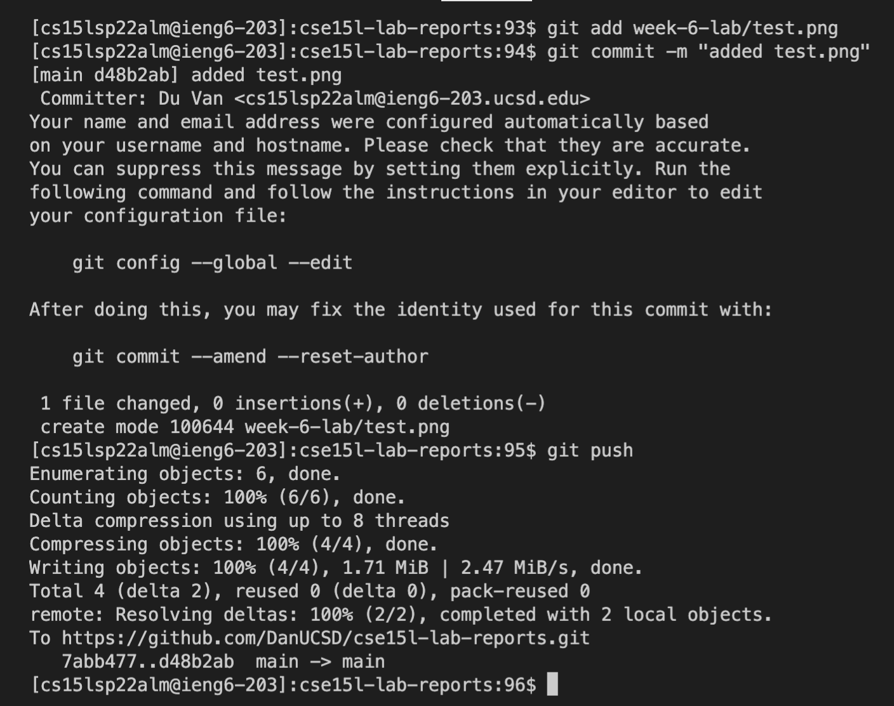
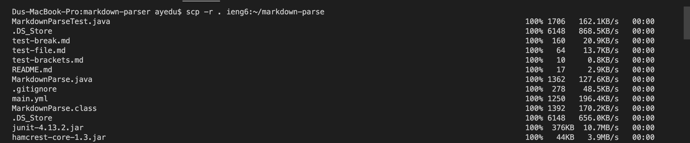
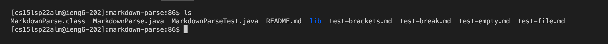
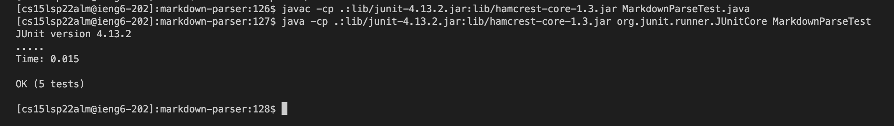

# Lab Report 3

## Streamlining ssh Configuration

Here, I used TextEdit to edit ~/.ssh/config. 

I logged in using ssh ieng6, which is the alias I chose to log in here.

Here, I used ieng6 to quickly transfer my schedule from my desktop to the remote server.

## Setup Github Access from ieng6

Here is my public key on GitHub

Here is my priv key stored in .ssh

Here is the git add, commit, and push commands from ieng6 to GitHub

[fromRemote](https://github.com/DanUCSD/cse15l-lab-reports/blob/main/week-6-lab/test.png)
Here is the resulting link to that file add

## Copy Whole Directories with scp -r

First screenshot shows the transferring of the directory. The second screenshot shows the resulting file in the remote server

Running tests on the remote server.
