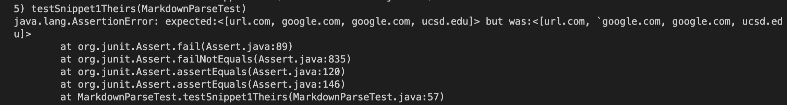

# Lab Report 4

My group's markdown parse repo
https://github.com/notweezer123/markdown-parse/blob/main/MarkdownParse.java

The markdown parse repo we're reviewing
https://github.com/YoavGutmanUCSD/markdown-parser-2/blob/main/MarkdownParse.java

## Snippet 1

My group's markdown parser. It did not pass the test.

- 

Other group's markdown parser. It did not pass the test.
- 

## Snippet 2

My group's markdown parser. It did not pass the test.

- 

Other group's markdown parser. It did not pass the test.

- 

## Snippet 3

My group's markdown parser. It did not pass the test.

- 

Other group's markdown parser. It did not pass the test.

- 

## Questions

For snippet 1, I don't think there is a small amount of code change that I can move to fix the bug. My group relied on every line having the format of ...[...]...(...) or something along those lines.

For snippet 2, my code fails for the same reason.

For snippet 3, the same reason still applies.